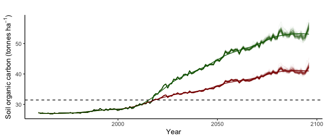

Project introduction: Soil carbon modelling in Morrocan agriculture
================
Dr Alasdair Sykes
25-04-2020

     

 

   

## 1\. Introduction

#### 1.1. Goal of project

The overall goal of this project is to estimate the soil carbon stocks,
and the potential for soil carbon stock change, in Morocco’s
agricultural production systems. To do this, you will use an
internationally parameterised steady state soil carbon model to make
quantitative predictions of soil carbon stocks and stock change based on
input data characterising agricultural activities and soil types.

#### 1.2. Skills developed

This project will combine spatial data, agricultural statistics and
climate models with a steady-state soil C modelling approach. Key skill
development will be:

  - Understanding of steady-state soil carbon models
  - Designing, scoping and executing modelling studies
  - Model scenario testing and sensitivity testing
  - Use of the R programming language
  - Manipulation and harmonisation of spatial data
  - Big data handling and analysis in the R environment

**A plea (and a pitch) from Alasdair**. *Teaching technical, code-heady
classes of this type, I tend to find that this point (i.e. where I’ve
just mentioned one or more of “R”, “code”, “big data” and “modelling”)
is usually the point where a significant portion of the class checks
out. Typical reasons are “I’m not good at coding”, “Numbers aren’t my
thing”, or that old favourite “My computer hates me”. If you just had
this mental reaction, I totally get it. No-one is born good at this
stuff, and no-one just wakes up one day being good at it either. But
science is increasingly computationally-focused, and it is a really,
really important skill to nurture. As a data scientist, I’m biased, but
the reason I learned this stuff is that it gives me an unparalleled
medium for sharing my knowledge and the results of my work. I’ve
designed this project to give you an insight into where modelling and
data science can take you in this field — all the models and data in
this repository are ‘real’ — and so, if you’re tired of feeling dread
whenever you walk into a code-based class, or you want to get these
skills on your CV, consider giving this project a shot.* ✌️

#### 1.3. Overview of project

You have been provided with an implementation of the IPCC (2019)
steady-state soil C stock model for global croplands. This model is
capable of estimating C stocks—and stock change over time—in soils under
croplands. It has been parameterised such that it is possible to utilise
this model to simulate—in theory—any cropland soil, anywhere in the
world.

Your task will be to define and execute a series of cases studies using
this model (in the order of 4–8, though the exact number is up to you)
which examine the potential for C sequestration under Moroccan
agricultural systems, and are as representative of Moroccan agriculture
as a whole as possible.

To do this, you will need to:

1.  Decide, based on available agricultural statistics and gridded data,
    which crops and agricultural areas should form the basis of your
    case studies.

2.  Source, extract and format model input data for each of these case
    studies.

3.  Run the model and analyse the results.

More detail on each of these separte elements is provided below in
section 4.

**Note:** *You should treat everything provided in this project
repository as a giant digital toolbox. By this I mean that the model
app, all of the base data, and all of the helper functions provided are
designed to equip you with a powerful jumping-off point from which to
conduct your own analysis. It is up to you to decide how to use these
materials and which questions you wish to answer. I will be on hand to
help you make these decisions, but it is up to you to take the
initiative and direct your own project.*

**Also note:** *You have no doubt downloaded this file as part of the
.zip folder from Learn. This is totally fine and you can skip to the
next section here if you want — but for those who want to see the ‘real
deal’ of how this came together, the live version of this project, with
nothing stripped out or simplified, is hosted
[here](https://github.com/aj-sykes92/msc-morocco-soil-c-modelling). You
can view it, clone it, and even use it as the start of your own project
if you wish — this, in a nutshell, is the real value of open-source
coding.*

## 2\. How does the model work?

The model is a simplified, steady-state, three-pool soil carbon model.
By steady-state, it is meant that the model tries to deternine a soil C
equilibrium, assuming consistency of year-on-year inputs. These three
pools are differentiated primarily by different decay rates (i.e. rates
at which soil carbon is lost, via microbial mineralisation, to the
atmosphere as CO2). These pools are:

1.  The active pool, which varies the most year on year, and has the
    highest rates of inputs and decay. It is fed by organic C inputs and
    by the slow and passive pools.

2.  The slow pool, which varies less than the active pool and has lower
    decay rates. It is fed by the active pool and by organic C inputs.

3.  The passive pool, which has the slowest rates of input and decay. It
    is fed by the active and slow pools only—it does not receive any
    direct organic C inputs.

The model simulates the flow of organic carbon into, out of and between
these pools. The result can be used to estimate the net removal or
addition of CO2 to or from the atmosphere. Environmental
parameters for the model include monthly temperature, monthly
precipitation, monthly potential evapotranspiration and soil sand
fraction. Management related parameters include C inputs from crops,
lignin and N content of organic matter, tillage practices and manure
inputs. All of these things affect how quickly the pools gain and lose
carbon, and how carbon flows between them.

The version of the model has been implemented using R, and is provided
to you alongside an RShiny app which will allow you to use this model
via a simple user interface.

## 3\. How is this model implementation set up?

This model implementation has been set up for use in Morocco’s
agricultural systems in the time period(s) 1961–2097. Since the model
relies greatly on climate parameters, I have used a mixture of
historical data (up to 2019) and climate predictions (2020–2070) to set
up this implementation of the model. Future climate is uncertain, so
from 2019 onwards, you will see the model run multiple (*n* = 100)
scenarios which capture this uncertainty. We could easily run more
scenarios, but 100 makes for a good balance between insight and
computational demand.

Climate prediction data are sourced from the UKCP and can be found
[here](https://www.metoffice.gov.uk/research/approach/collaboration/ukcp/download-data).

In this implementation, the model utilises three main data files. These
are found in the **model-data** folder and are as follows:

1.  Crop data (default file = **morocco-example-crop-data.csv**). This
    file tells the model what crop is being grown, how much yield it
    produces, and what management practices are used. While you have an
    R script (**helper-scripts/model-data-creator.R**) to assist you in
    writing versions of this file, the file itself is a .csv which can
    be opened, viewed and edited manually using MS Excel or any other
    program with .csv reading capability.

2.  Manure data (default file = **morocco-example-manure-data.csv**).
    This file tells the model what manure is used, and how much (if any)
    is applied. This file is also written with
    **helper-scripts/model-data-creator.R**, and, as a .csv can also be
    opened, viewed and edited manually if desired.

3.  Climate data (default file = **morocco-example-climate-data.rds**).
    This file tells the model what the climate is like over the duration
    of the model run (in this case, meaning monthly precipitation,
    temperature and potential evapotranspiration). It is written using
    **helper-scripts/model-data-creator.R** like the other input files;
    however, it saved in .rds format (R’s native file format) as it is
    quite large and complex, meaning it is not possible to edit manually
    (instead, you will need to modify the script which creates it if you
    wish to change any part of it).

To create new model scenarios, you will manually modify these files. For
ideas on how to do this, refer to **6. Project Tasks**, below.

## 4\. Getting started

This project will involve using R and RStudio. For those of you who are
less than confident in this environment, fear not—**while you are not
going to get away without at least looking at and modifying some
existing code, it is entirely possible to complete the project to a high
standard with minimal or no writing of brand new R scripts**. For those
R enthusiasts amongst you, you will have complete and unrestricted
access to all of the code with which this model is built and executed.
If you ever wanted to get in amongst the workings of some relatively
advanced R programming (like Shiny apps, functional programming,
steady-state modelling and Monte Carlo simulation), this is your chance.

Regardless of where you are on the R enthusiasm scale, you need to make
sure of the following before you start:

1.  You have R version 3.6.2 or higher installed on your computer. You
    can check the version of R you are running by typing
    `R.version.string` into the console, and R will return the version
    for you. If you are not running v3.6.2 (or you don’t have R
    installed at all), [this
    page](https://uvastatlab.github.io/phdplus/installR.html) provides
    install links for Windows and MacOS.

2.  You have RStudio version 1.2.5033 or higher installed on your
    computer. You can check this by opening RStudio and going to ‘About
    RStudio’ on the top menu (the exact location varies depending on
    Mac/Windows layouts). If you don’t have this version installed, you
    can find the install link for Mac and Windows
    [here](https://rstudio.com/products/rstudio/download/#download).

3.  You have the `tidyverse` and `shiny` packages installed and up to
    date. This is crucial—the model won’t run without this step\! This
    simplest way to check this is to type
    `install.packages(c("tidyverse", "shiny"))` into the console and hit
    return. If you don’t have them installed, this will install them; if
    you do, it’ll update them as necessary.

**Note: I realise it’s annoying to go through these steps before
starting. It’s good practice to update your R/RStudio versions
regularly—it saves annoying errors and time wasted trying to figure
out why. If you really want to skip the first two steps, you can, but if
anything goes wrong when running the model, please come back to this
stage and update everything as a first port of call. The last step
(installing your packages) is not optional, and all you will get is pain
and error messages if you skip this one\!**

## 5\. Launching and using the model UI

I will give everyone interested in this project a full walkthrough of
how to use the model in the live introduction to this project. I will
also make sure there is a video tutorial available in the Learn folder.
As a quick reminder, here are the steps you need to go through to run
the Shiny app version of the model:

1.  Open RStudio.

2.  In the top right-hand corner of RStudio, click the dropdown arrow
    next to where it says **Project: None** (note, if you already have
    an RStudio Project open, it’ll say the name of that project instead
    of **Project: None**. Close it now if this is the case. If you don’t
    know what an RStudio Project is, don’t worry about it\!).

3.  Click **Open Project** and navigate to the folder where you’ve saved
    and extracted the project download folder. Double click on the
    **.RProj** file to open it (it’ll be the only one in the folder
    that’s not greyed out).

4.  Click to the files tab in your bottom right-hand window, and click
    on the file entitled **app.R**.

5.  When **app.R** opens in your main window, look for the green *Play*
    button on the top right of that window, with **Run App** written
    next to it. Click that button and the model UI will launch.

6.  You are now ready to set up and run model scenarios using the data
    input tools provided. Refer to the video tutorial for a full
    walkthrough of this process.

## 6\. Project tasks

If you’ve had a good look through the project folder, and followed along
with the live project introduction, you should by now (hopefully) have
quite a few ideas of things you might like to look into. The below is a
quick overview of the different steps you should consider.

**Remember: You have a lot of data available to you in this folder
(including everything you need to potentially run millions of different
model scenarios), but you should not restrict yourself to this data for
your decision making. You have the entire worldwide web at your
disposal—if you have a question that can’t easily be answered with
this data, I expect you to look into the available literature and online
data repositories to find the answer.**

### 6.1. Definition of study scope and selection of case studies

For this, your starting point is the R script
**helper-scripts/model-data-creator.R**. The job of this script is to
help you to a) visualise the helper data provided (all saved in the
**helper-data/** folder) and b) extract from this raw data the input
files required by the model.

If you run this script as is, it will extract and save the example data
which is currently used in the model (saved in the **model-data/**
folder). Your main task here is to understand how this script works, and
modify it as necessary to create input files that represent the
scenarios you want to analyse.

Think about:

1.  Which crop(s) you want to look at. Which are produced most by
    Morocco? Are any increasing in area or yield? Which are most
    economically important?

2.  What geographical areas do you wish to consider? Look at the crop
    production raster data, as well as information from the web, and
    decide on an area (or set of areas) that are representative.

3.  What hypothetical scenarios do you want to think about? You are not
    constrained to modelling things which are strictly representative of
    current practice; the model simulation extends far into the future
    for this reason. How might you improve soil management in your
    chosen scenarios to maximise sequestration? How will you ensure this
    is realistic?

### 6.2. Set up and run model

Refer to Section 4 and the video materials to set up and execute your
model runs. Note that you are not confined to the model UI—it’s there to
provide a comfortable environment in which to run the model, but this
comes at the expense of efficiency and true control. If you’re not
afraid of a bit of coding, check out the R script **ipcc-model-setup.R**
in the base directory. This script is used to create default scenario in
the model UI, but you can modify it as you see fit if you want to run
the model from the RStudio console.

### 6.3. Results analysis

The model UI gives you some visual and numeric outputs right away, and
you should feel free to use these as much as you like. It also gives you
the option to export your data to a .csv file, which you can use however
you see fit to conduct your analysis. If you want true control over the
this part of the project, you can do as suggested in 3.2 and run the
model in the RStudio console using modifications of the R script
**ipcc-model-setup.R**. This will give you the complete and unabridged
model output to analyse as you see fit.

I expect you to define your own research questions, but if you need
inspiration, you can think about answering questions like the following:

1.  Where are areas/crops with the greatest potential for C
    sequestration?

2.  Which crops/areas are most at risk of C loss?

3.  What environmental policies would be most effective to increase soil
    C sequestration in Morocco, and what quantitative effect might these
    have?

4.  What input factors are most important for determining soil C
    sequestration in these systems?

Like any scientific study, I expect you to clearly define your research
questions at the start of your project, and design your analysis to
answer them.

## 7\. Some things to think about

Below are some more ideas for additional areas you might like to look
into as part of your projects:

1.  Climate predictions are notoriously uncertain. You can see how this
    uncertainty is accounted for by looking at the final section of the
    **model-data-creator.R** script—the role of this part of the code is
    to generate the uncertainty in the climate data and save it into the
    file used by the model. At the moment it’s highly arbitrary. Can you
    improve it? How about doing a climate-focused sensitivity analysis?

2.  Crop yield and area predictions are also uncertain. Future crop
    yield and area has been simulated very simplistically for this
    model. Could you improve it? At the moment, every run of the model
    uses exactly the same predictions for these variables. Do you think
    this is useful? Could you change it?

3.  The model doesn’t include any data on costs. This is by design (it’s
    a pure soil systems model, not an economic model), but the first
    question on the lips of any policymaker is often to do with cost.
    Can you source cost/benefit data to add to your scenarios and turn
    them into a fuller set of environmental management recommendations?

## 8\. That’s all folks

I hope this makes for an interesting project. Feel free to play with the
model (and accompanying code) as much as you like, and experiment with
its capabilities. My hope is that the materials provided here will
provide you with a comprehensive support base for your project, and
allow you to focus on the more compelling, dynamic elements of
modelling. I will be on hand throughout the entire project to advise,
problem-solve, help with coding and generally support you in your
project development. Enjoy\!

## Appendix — folder schema

This appendix provides a description of all the files and
sub-directories provided to you in the download folder
**msc-morocco-soil-c-modelling.zip**. You don’t have to memorise it in
order to use the model effectively(\!), but it is here for you to refer
to should you have questions about any aspects of the way the model is
constructed.

### \~/helper-data

This folder contains all of the data files which have been constructed
to give you a basis from which to build model scenarios. The script
**helper-scripts/model-data-creator.R** draws exclusively on these files
and translates them into model inputs. All the files it contains are
saved in .rds format for consistency.

**\~/helper-data/morocco-climate-data-helper-raster.rds**. A simple
raster file which is used in conjunction with the more complex
multi-level data file **morocco-full-climate-data-1902-2097.rds** to
allow spatial points-based selection from this file.

**\~/helper-data/morocco-crop-area-ha-2010.rds**. A raster brick which
gives spatially explict estimates of Moroccan crop area for the year
2010. Derived from MapSPAM data which can be found
[here](https://www.mapspam.info).

**\~/helper-data/morocco-crop-yield-tonnes-per-ha-2010.rds**. A raster
brick which gives spatially explict estimates of Moroccan crop yield for
the year 2010. Derived from MapSPAM data which can be found
[here](https://www.mapspam.info).

**\~/helper-data/morocco-crop-yields-faostat-1961-2018.rds**. A
non-spatially explicit dataframe-based time-series of crop yields and
areas in Morocco. Derived from
[FAOstat](http://www.fao.org/faostat/en/). Useful to see which crops the
model may simulate.

**\~/helper-data/morocco-full-climate-data-1902-2097.rds**. A
multi-level dataframe containing spatially specific timeseries estimates
of Moroccan climate (both historical series and climate predictions). It
is based on data from the
[UKCP](https://www.metoffice.gov.uk/research/approach/collaboration/ukcp/download-data).

**\~/helper-data/morocco-shapefile.rds**. A shapefile outlining Morocco.
The model doesn’t use this directly, but it was used in the creation of
all the spatial datasets, and remains useful for map-type
visualisations.

**\~/helper-data/morocco-soil-sand-percentage.rds**. A raster file with
estimates of soil sand % across Morocco. Originally derived from the
[SoilGrids](https://soilgrids.org/#!/?layer=ORCDRC_M_sl2_250m&vector=1)
data repository.

#### \~/helper-scripts

A folder containing just one R script, the role of which is to translate
data in the **helper-data** folder into usable model inputs. You can
also use this folder to save files which you write yourself for the same
purpose.

**\~/helper-scripts/model-data-creator.R**. An R script which draws
exclusively on the **helper-data** files and translates them into model
inputs. You can (and should) modify this file to create new model
inputs. The script has been commented extensively to point you to
elements which you might want to modify.

#### \~/model-data

A folder containing files which the model may utilise as inputs. These
files can be loaded into the model using the user interface in
**app.R**.

**\~/model-data/morocco-example-crop-data.csv**. An example of a crop
management data file which can be used in the model. Also taken by the
model as implemented in **app.R** as its default scenario.

**\~/model-data/morocco-example-manure-data.csv**. An example of a
manure management data file which can be used in the model. Also taken
by the model as implemented in **app.R** as its default scenario.

**\~/model-data/morocco-example-climate-data.rds**. An example of a
climate data file which can be used in the model. Also taken by the
model as implemented in **app.R** as its default scenario.

#### \~/model-scenarios

A folder containing complete runs of the model. As supplied, this folder
contains just one file (the model default scenario), but may be used to
store more that you create.

**\~/model-scenarios/scenario-baseline.rds**. An example run of the
model which is used as the default baseline by **app.R**.

#### \~/parameter-data

A folder containing files from which the model draws its default
parameters. You don’t need to modify any of these files unless you wish
to examine the effect of changed parameters on the way the model
functions (for example, as part of a sensitivity analysis).

**\~/parameter-data/above-ground-residue-coefficients.csv**. A file
containing parameters relating to above-ground crop residue composition
for different crops.

**\~/parameter-data/below-ground-residue-coefficients.csv**. A file
containing parameters relating to below-ground crop residue composition
for different crops.

**\~/parameter-data/crop-n-and-lignin-fractions.csv**. A file containing
parameters relating to the nitrogen and lignin content of different crop
residue types.

**\~/parameter-data/manure-coefficients.csv**. A file containing
parameters relating to the composition of different types of livestock
manure.

**\~/parameter-data/model-parameters.csv**. A file containing the main
model parameters controlling carbon/organic matter flows into, out of
and between the model C pools.

#### \~/read-me-im-your-tutorial-handout.html

This project handout file.

#### \~/msc-morocco-soil-c-modelling.Rproj

The RStudio projects file which stores information about the whole
directory. Double-click this file to open the associated project
(i.e. the model and everything which accompanies it) in RStudio.

#### \~/app.R

The RShiny app which provides an interactive user interface for the
model. This R script contains all the coding to build the app user
interface (the parts you see and interact with as a user) and the server
(the part that does the actual computations). If you want to look at
this to figure out how a simple Shiny app is built, feel free to dive in
— but you won’t need to modify it to complete your tasks.

#### \~/ipcc-c-model-functions.R

The functions which together create the model. The file **app.R**
sources this file (‘source’ meaning to run all the code a script
contains) in order to build all the functions it requires to make the
model work.

#### \~/ipcc-c-model-setup.R

You can think of this script as an alternative to **app.R**. It does the
same thing (i.e. builds and runs the model), but it does it via a plain
R script rather than as a Shiny app. It is currently written to build
the example scenario (saved in
**model-scenarios/scenario-baseline.rds**) which **app.R** uses as its
initial default, but this script can be modified and re-run (by those of
you keen to roll up your sleeves and do some coding) to create different
model scenarios.
